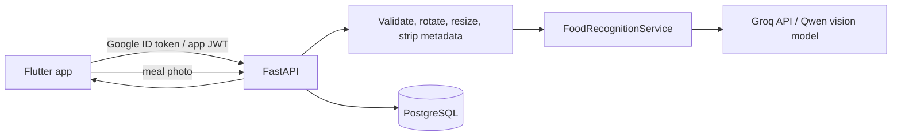

# CaloAI

Flutter calorie tracker with a FastAPI backend, PostgreSQL storage and replaceable food-recognition providers.

## Architecture



The Flutter UI keeps Provider state management and its current screens/theme. Google sign-in is verified by the backend; the backend then issues short-lived access and rotating refresh tokens. Tokens are stored with platform secure storage. Food photos are sent to FastAPI, normalized in memory, and forwarded to the configured provider. Analysis is saved as pending review; confirmed meal values are stored separately from the original model estimate.

AI settings are backend-only: `FOOD_RECOGNITION_PROVIDER`, `GROQ_MODEL`, and `GROQ_API_KEY`. The default provider is Groq using `qwen/qwen3.8-27b` for food-photo analysis and recipe translations. Groq's free plan has request and token limits; check the account's current limits in the Groq Console. Gemini remains available as an optional provider by setting `FOOD_RECOGNITION_PROVIDER=gemini` and configuring its backend key.

## Backend setup (local development)

Requirements: Python 3.11+, Docker Desktop, and a Google OAuth web client ID configured for Google Sign-In.

```powershell
Copy-Item backend/.env.example backend/.env
docker compose up -d postgres
```

Edit `backend/.env` and set:

- `JWT_SECRET`: a long random secret, for example `python -c "import secrets; print(secrets.token_urlsafe(48))"`
- `GOOGLE_CLIENT_ID`: OAuth **Web application** client ID; use the same ID for the Flutter `GOOGLE_SERVER_CLIENT_ID` build define.
- `GROQ_API_KEY`: API key kept on the backend only. Create one in the Groq Console and configure it as a secret on Render.
- `GROQ_MODEL`: defaults to `qwen/qwen3.8-27b`.
- `DATABASE_URL`: local PostgreSQL URL matching the compose service.

Then install and run the backend:

```powershell
Set-Location backend
py -m venv .venv
.\.venv\Scripts\Activate.ps1
python -m pip install -e .
alembic upgrade head
uvicorn app.main:app --reload --host 0.0.0.0 --port 8000
```

FastAPI docs are available at `http://localhost:8000/docs` and health at `/health`.

## Flutter setup

From the repository root:

```powershell
flutter pub get
flutter run --dart-define=API_BASE_URL=http://10.0.2.2:8000 --dart-define=GOOGLE_SERVER_CLIENT_ID=YOUR_WEB_CLIENT_ID
```

`10.0.2.2` is the Android emulator address for the host machine. For an iOS simulator, use `http://localhost:8000`; for a physical device, use the development computer's LAN address. Use HTTPS outside local development.

## Initial database model

- `users`, `auth_identities`, `auth_sessions`: app users, verified Google identities, and hashed/rotating refresh sessions.
- `meals`, `meal_items`: user diary and user-confirmed food nutrition.
- `food_analysis_results`: provider/model, original estimate, review state and latency; linked to a meal after confirmation.
- `daily_nutrition`: recomputable per-user/per-day totals.
- `weight_entries`: date-stamped weight history.

Images are not persisted by the analysis endpoint. The API strips image metadata and stores only the analysis result. Do not put production secrets in this repository; `.env` files are ignored by Git.

## API endpoints

- `POST /api/v1/auth/google`, `POST /api/v1/auth/refresh`, `POST /api/v1/auth/logout`
- `GET/PUT /api/v1/me/profile`
- `POST /api/v1/food/analyze`
- `GET/POST /api/v1/me/meals`, `DELETE /api/v1/me/meals/{meal_id}`
- `GET/POST /api/v1/me/weight`

## Tests

```powershell
flutter test
Set-Location backend
python -m pip install -e ".[dev]"
pytest
```
